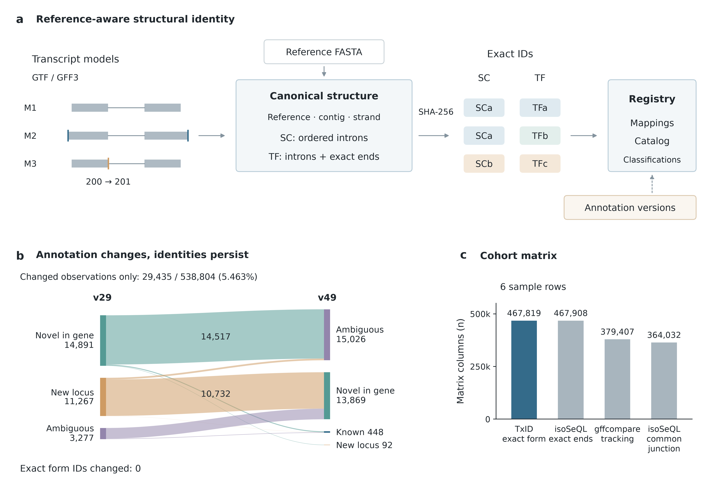

# TxID: a reference-aware identity specification for long-read transcript models

# TxID：面向长读长转录本模型的参考序列感知型身份规范

## Abstract

## 摘要

### Summary

### 概述

TxID provides a versioned, reference-aware identity specification and registry for GTF/GFF3 transcript models, enabling independent analyses to recompute common structural keys for exact splice chains, transcript forms and single-exon models while recording annotation-dependent classifications and provenance separately. Evaluation across 538,804 ENCODE WTC11 observations showed stable exact identifiers despite input permutation and 29,435 annotation-classification changes; a real-read IsoQuant–StringTie case joined 110 shared reference-known forms across independently initialized registries, with a separately implemented parser and identity calculator confirming the joins.

TxID 为 GTF/GFF3 转录本模型提供版本化、纳入参考序列信息的身份规范及注册库，使独立分析能够重新计算精确剪接链、转录本形式和单外显子模型的共同结构键，同时单独记录依赖注释的分类与溯源信息。对 538,804 条 ENCODE WTC11 观测的评估表明，输入顺序置换和 29,435 条观测的注释分类变化均未改变精确标识符；一个基于真实读段的 IsoQuant–StringTie 案例在独立初始化的注册库之间关联了 110 种共享的参考已知形式，并由单独实现的解析器和身份计算器确认关联结果。

### Availability and implementation

### 可用性与实现

TxID requires Python 3.10 or later, has no runtime dependencies and uses a BSD 3-Clause license. Source code, the versioned specification, tests and installation instructions are supplied in the accompanying TxID 0.1.3 source archive.

TxID 需要 Python 3.10 或更新版本，无运行时依赖，采用 BSD 3-Clause 许可证。源代码、版本化规范、测试及安装说明包含在随附的 TxID 0.1.3 源码归档中。

### Supplementary information

### 补充信息

Supplementary methods, input accessions, comparison tables and figure source data accompany this manuscript.

本文随附补充方法、输入数据登录号、比较表和图源数据。

## 1 Introduction

## 1 引言

Joining independently generated long-read RNA-seq catalogs requires a common definition of which transcript models represent the same structure. In the SQANTI3 workflow addressed by isoSeQL, sample-specific isoform identifiers complicate comparison, while jointly recollapsing an expanding collection can become costly (Liu and Chun, 2026). Structural equivalence also depends on the comparison: two models may have identical introns yet differ at their transcript ends.

关联独立生成的长读长 RNA-seq 转录本目录，需要共同界定哪些转录本模型代表相同的结构。在 isoSeQL 所面向的 SQANTI3 工作流程中，样本特异的转录本异构体标识符使比较更为复杂；随着数据集持续扩展，联合重新合并模型的成本也可能上升（Liu and Chun, 2026）。结构等价性还取决于比较的具体对象：两个模型可以具有完全相同的内含子，却在转录本末端存在差异。

Existing approaches support reconciliation at different stages. GffCompare tracks models across annotation files using structural comparisons that can group terminal variants (Pertea and Pertea, 2020). TALON tracks transcripts and abundance within a shared database (Wyman et al., 2020), whereas isoSeQL incrementally aggregates SQANTI3 outputs, linking intron chains, transcript ends, metadata and abundances (Liu and Chun, 2026). Isosceles assigns stable hashes to novel transcript paths for cross-study matching on the same genome build; its annotation preparation merges transcripts with matching intron structures and start/end bins, with a default bin size of 50 bp (Kabza et al., 2024).

现有方法在不同环节支持模型协调。GffCompare 通过结构比较跨注释文件追踪模型，其分组可以将末端不同的变体归为一组（Pertea and Pertea, 2020）。TALON 在共享数据库中追踪转录本及其丰度（Wyman et al., 2020）；isoSeQL 则以增量方式汇总 SQANTI3 输出，关联内含子链、转录本末端、元数据和丰度（Liu and Chun, 2026）。Isosceles 为新转录本路径赋予稳定哈希标识，以便在同一基因组版本下跨研究匹配；其注释预处理将内含子结构及起止位置分箱均匹配的转录本合并，默认分箱宽度为 50 bp（Kabza et al., 2024）。

Content-derived naming also has precedents in gene annotation through UniqTag (Jackman et al., 2015) and genomic variation through the GA4GH Variation Representation Specification (Wagner et al., 2021). TxID provides a versioned, reference-aware identity specification for supplied GTF/GFF3 transcript models, with an accompanying registry. It specifies exact splice-chain, transcript-form and single-exon identities, the reference sequence-collection fingerprint and canonical serialization. This explicit contract allows separate implementations to recompute and verify structural keys without shared assignment history. Annotation-dependent classifications, registry-managed locus and fuzzy-cluster assignments, and observation provenance remain separate from exact identity.

基于内容命名也有其他先例，包括用于基因注释的 UniqTag（Jackman et al., 2015），以及用于基因组变异的 GA4GH 变异表示规范（Wagner et al., 2021）。TxID 为输入的 GTF/GFF3 转录本模型提供一套版本化身份规范及配套注册库，将参考序列上下文纳入身份定义。该规范明确了精确剪接链、转录本形式和单外显子身份的定义，以及参考序列集合指纹和规范化序列化规则。依据这些明确的规则，不同实现无需共享以往的标识符分配记录，即可重新计算并核验结构键。依赖注释版本的分类、由注册库管理的基因座和模糊簇归属，以及观测的溯源信息，均与精确身份分开保存。

## 2 Implementation

## 2 实现

TxID implements a versioned identity specification for GTF/GFF3 models against a declared reference FASTA and annotation. The reference fingerprint hashes sorted primary contig names, lengths and SHA-256 digests of normalized sequences. Input contigs resolve through primary names or an explicit alias table; renaming FASTA contigs changes the context. Models use 1-based closed coordinates. Exons are sorted genomically; adjacent exons [a,b] and [c,d] define intron [b+1,c−1], with introns ordered by transcriptional direction. Validation rejects unknown contigs, out-of-range coordinates and overlapping exons. Exact identity is confined to this sequence collection; cross-assembly equivalence is not established.

TxID 实现了一套具有版本定义的身份规范，以声明的参考 FASTA 和注释为上下文，处理 GTF/GFF3 转录本模型。参考指纹对排序后的主 contig 名称、长度以及规范化序列的 SHA-256 摘要进行哈希计算。输入中的 contig 通过主名称或显式别名表解析；重命名 FASTA 中的 contig 会改变这一上下文。模型采用从 1 开始的闭区间坐标。外显子按基因组位置排序，相邻外显子 [a,b] 和 [c,d] 定义内含子 [b+1,c−1]，内含子则按转录方向排序。验证过程拒绝未知 contig、越界坐标及相互重叠的外显子。精确身份仅适用于这一序列集合，不建立跨基因组组装的等价关系。

Canonical JSON objects contain the algorithm family, reference fingerprint, primary contig and strand. For multi-exon models, `txid:SC1` encodes the complete intron chain; `txid:TF1` adds the exact, strand-aware outer boundaries defining model transcription start and end. Identical chains with different ends therefore share SC1 but have distinct TF1 identifiers (Fig. 1a). Single-exon models receive `txid:SE1` identifiers from exact start and end coordinates. The specification fixes lexicographically sorted JSON keys, integer coordinates, UTF-8 encoding, unescaped Unicode and no insignificant whitespace, allowing the canonical bytes and identifiers to be recomputed independently. SHA-256 hashes these bytes; public identifiers use its first 24 hexadecimal characters. The registry stores the full digest and canonical object and rejects conflicting public identifiers. Samples, upstream names, annotation releases and import order are excluded from the hash inputs. Changing these rules requires a new identity-family version.

规范化 JSON 对象包含算法家族、参考指纹、主 contig 和链方向。对于多外显子模型，`txid:SC1` 编码完整内含子链；`txid:TF1` 还编码考虑链方向的精确外侧边界，用于定义模型的转录起始与终止位置。因此，内含子链相同但末端不同的模型共享 SC1，同时具有不同的 TF1 标识符（图 1a）。单外显子模型根据其精确起止坐标获得 `txid:SE1` 标识符。规范明确要求 JSON 键按字典序排列、坐标为整数、采用 UTF-8 编码、Unicode 字符不转义且不含非必要空白，从而使规范化字节序列及标识符能够被独立重新计算。SHA-256 对这些字节进行哈希计算，公开标识符采用摘要的前 24 个十六进制字符。注册库保存完整摘要和规范化对象，并拒绝冲突的公开标识符。样本、上游名称、注释版本和导入顺序均不参与哈希输入。 改变这些规则需要启用新的身份算法家族版本。

Annotations receive separate normalized fingerprints and supply classifications and reference aliases. An exact reference-form match preserves the selected reference `gene_id` and `transcript_id` in rewritten annotations, with TxIDs recorded separately. Otherwise, overlap with exactly one same-strand reference gene span assigns that gene identifier and a TxID transcript identifier. Multiple overlapping genes remain explicit candidates; ambiguous assignments and models without same-strand gene overlap receive persistent `txid:GL1` locus accessions. Gene-span overlap records an assignment rather than biological gene membership. Optional fuzzy grouping uses recorded splice and end tolerances, requires mutual compatibility within each cluster and marks ambiguous bridges. Its `txid:FC1` accessions preserve exact identities. FC1 and GL1 are registry-managed accessions without the portability guarantees of exact structural identifiers.

注释具有单独的规范化指纹，并提供分类信息和参考别名。模型与参考转录本形式精确匹配时，重写注释保留所选参考条目的 `gene_id` 和 `transcript_id`，同时单独记录 TxID。未发生精确匹配时，若模型恰与一个同链参考基因的基因组区间重叠，则使用该基因的标识符，并赋予一个 TxID 转录本标识符。存在多个重叠基因时，明确保留这些候选基因；归属存在歧义的模型及不与同链基因重叠的模型获得持久的 `txid:GL1` 位点登录号。基因区间重叠用于记录归属分配，并不确立生物学上的基因归属。可选的模糊分组采用已记录的剪接与端点容差，要求每个簇内的成员彼此兼容，并标记存在歧义的桥接对象。其 `txid:FC1` 登录号不改变精确身份。FC1 和 GL1 均为注册库管理的登录号，不具备精确结构标识符的可移植性保证。

A versioned SQLite registry separates structural objects from observations, annotation contexts and provenance. Each input is staged and validated before an atomic transaction; checksums and manifests support idempotent retries. Provenance records sample, upstream tool, original identifiers and attributes, software version and options. Outputs from a fixed registry are deterministically sorted and comprise rewritten GTFs, per-sample mapping tables and a cohort catalog. Preserved reference names and TxID transcript names coexist, while `txid_form` provides a common exact key for joining external sample-by-transcript matrices. TxID operates on supplied models and measurements and does not estimate abundance.

具有版本管理的 SQLite 注册库将结构对象与观测、注释上下文及溯源信息分开存储。每个输入均在原子事务开始前完成暂存和验证；校验和与导入清单支持幂等重试。溯源信息记录样本、上游工具、原始标识符及属性、软件版本和选项。对于固定的注册库，输出采用确定性排序，包括重写的 GTF、逐样本映射表和队列目录。保留的参考名称与 TxID 转录本名称可以并存，而 `txid_form` 为连接外部样本×转录本矩阵提供统一的精确键。TxID 处理外部提供的模型和测量值，不估计丰度。

## 3 Evaluation and discussion

## 3 评估与讨论

Evaluation tested conformance to the identity specification and portability of its structural keys. Historical experiments used TxID 0.1.0. A simulation generated 2,511 observations from 120 latent templates through boundary perturbations and four caller-style serializers. TxID recovered 190 emitted forms without false-merge or false-split pairs against exact emitted structure. Perturbations nevertheless fragmented 70 latent templates into multiple exact forms, illustrating how faithful structural identification preserves differences introduced upstream.

评估检验了结构键是否符合身份规范，以及这些键的可移植性。历史实验使用 TxID 0.1.0。模拟实验以 120 个潜在模板为基础，通过边界扰动和四种模拟工具输出风格的序列化方式生成 2,511 条观测。以实际输出结构的精确一致性为参照，TxID 识别出 190 种输出形式，未出现错误合并或错误拆分的观测对。然而，扰动使 70 个潜在模板分成了多个精确形式，说明忠实于结构的身份标识也会保留上游引入的差异。

For fixed models, six released ENCODE WTC11 TALON annotations supplied 538,804 observations from three PacBio capped-mRNA and three ONT direct-RNA outputs on GRCh38 (ENCODE Project Consortium et al., 2020). Equality of contig, strand and exon intervals defined the structural target. The scoring script reused the TxID parser, making this a coordinate-consistency check. TxID assigned 467,819 exact forms, with no false splits among 100,680 same-target pairs or false merges among the same number of same-ID pairs.

固定模型评估采用六份已发布的 ENCODE WTC11 TALON 注释，共包含 538,804 条观测，均基于 GRCh38，其中三份来自 PacBio 加帽 mRNA 数据，三份来自 ONT 直接 RNA 测序数据（ENCODE Project Consortium et al., 2020）。结构参照由 contig、链方向和外显子区间的相等关系定义。评分脚本复用了 TxID 解析器，因此该项检验针对坐标层面的一致性。TxID 分配了 467,819 种精确转录本形式；在 100,680 个结构参照相同的观测对中未出现错误拆分，在同等数量标识符相同的观测对中未出现错误合并。

Comparisons used gffcompare 0.12.10 and isoSeQL 1.0.1 after SQANTI3 6.0.1 characterization (Pardo-Palacios et al., 2024). isoSeQL exact ends yielded 467,908 groups, no false-merge pairs and 93 false-split pairs. Its disclosed compatibility patch used `INSERT OR IGNORE` for duplicate count records, retaining source names and structural queries. gffcompare produced 379,407 tracking groups and omitted two observations. Its end-tolerant rule combined terminal variants in 55,494 groups; disagreement with exact-form equality is therefore not an overall performance ranking. Table S2 separates form and chain targets and pair denominators.

比较使用了 gffcompare 0.12.10，以及在 SQANTI3 6.0.1 表征后运行的 isoSeQL 1.0.1（Pardo-Palacios et al., 2024）。isoSeQL 精确末端层产生 467,908 个组，没有错误合并的观测对，有 93 个错误拆分的观测对。其已披露的兼容性补丁对重复计数记录使用 `INSERT OR IGNORE`，保留了来源名称和结构查询。gffcompare 产生 379,407 个追踪组，遗漏两条观测。其允许末端差异的规则在 55,494 个组中合并了末端变体；因此，与精确形式相等关系不一致并不代表整体性能排序。表 S2 分别列出形式与剪接链参照及相应观测对分母。

These equivalence rules determine matrix columns (Fig. 1c). Six-row binary occupancy matrices contained 467,819 TxID exact-form columns, 467,908 isoSeQL exact-end columns and 379,407 gffcompare tracking columns. Their entries record model presence. TxID matrix sparsity was 80.804%; column counts and sparsity describe structural organization rather than quantification accuracy.

这些等价规则决定了矩阵列的定义（图 1c）。六行二元占据矩阵分别包含 467,819 个 TxID 精确形式列、467,908 个 isoSeQL 精确末端列和 379,407 个 gffcompare 追踪分组列，矩阵中的条目记录模型是否存在。TxID 矩阵的稀疏度为 80.804%；列数和稀疏度描述的是结构组织方式，而非定量准确性。

Identity stability was tested across input order and annotation contexts. The recorded permutation preserved TxID exact identifiers and partitions. isoSeQL preserved its exact-end partition, although all numeric labels changed (Table S3). TxID locus accessions remained stateful, and full catalogs were not byte-identical. Between GENCODE v29 and v49 (Mudge et al., 2025), exact IDs remained unchanged while 29,435 classifications changed (5.463%; Fig. 1b). Following storage failure, the sixth v49 input was classified without persisting observations. Incremental snapshots, partly reconstructed from mappings, showed no lost exact keys or changed form-to-splice-chain associations; the final reconstruction matched the final catalog byte for byte.

身份稳定性检验覆盖输入顺序和注释上下文的变化。所记录的顺序置换未改变 TxID 精确标识符及分组划分。isoSeQL 的精确末端分组划分也未改变，尽管全部数值标签均有变化（表 S3）。TxID 位点登录号仍具有状态依赖性，完整目录在字节层面并不相同。在 GENCODE v29 与 v49 之间（Mudge et al., 2025），精确标识符保持不变，但有 29,435 条观测的分类发生变化（5.463%；图 1b）。存储故障后，第六份 v49 输入在未持久化保存观测的情况下完成分类。部分依据映射表重建的增量快照中，未出现精确键消失或形式与剪接链关联改变；最终重建结果与最终目录逐字节一致。

A real-caller case tested TxID 0.1.3. Whole-genome alignment of the first 100,000 reads of ENCFF105WIJ yielded 2,765 chr22 primary alignments. IsoQuant 3.13.0 and StringTie 3.0.3 produced 126 and 185 forms, respectively (Prjibelski et al., 2023; Kovaka et al., 2019). Independently initialized registries joined 110 shared forms into a two-row, 201-column caller-occupancy matrix despite disjoint original transcript names. All 110 were reference-known and shared reference aliases; this case demonstrates neither shared novel forms nor an advantage over reference-alias matching. A separately implemented GTF reader and identity calculator confirmed zero false or missed exact joins (0/110 pairs each). Six shared chains contained seven cross-caller pairs with different ends, retaining distinct form IDs. Reciprocal incremental imports preserved existing keys, canonical objects and form-to-chain associations. Table S6 reports chain comparisons and denominators; matrix rows represent caller outputs of one sample.

真实工具输出案例使用 TxID 0.1.3。对 ENCFF105WIJ 的前 100,000 条读段进行全基因组比对，得到 2,765 条 chr22 主比对记录。IsoQuant 3.13.0 和 StringTie 3.0.3 分别产生 126 和 185 种形式（Prjibelski et al., 2023；Kovaka et al., 2019）。两套独立初始化的注册库将 110 种共享形式关联到一个两行、201 列的工具输出占据矩阵中，而原始转录本名称没有交集。这 110 种形式均为参考已知形式，且具有相同的参考别名；该案例既未展示共享的新转录本形式，也未证明优于参考别名关联。单独实现的 GTF 读取器和身份计算器确认，精确关联中既无错误关联，也无遗漏关联（两项分别为 0/110 个观测对）。六条共享剪接链包含七个末端不同的跨工具观测对，这些形式保留了不同的标识符。分别向各注册库增量导入另一工具的输出后，已有键、规范化对象及形式与剪接链的关联均未改变。表 S6 列出剪接链比较及分母；矩阵行表示同一样本的不同工具输出。

The evidence covers one cell line, fixed TALON models and a bounded two-caller case. Exact identities retain caller boundary errors; discovery accuracy, expression estimates, gene-span assignment and fuzzy grouping were not biologically validated. The comparisons did not evaluate the shared-database TALON workflow. Within this scope, TxID makes structural equivalence explicit and independently checkable, providing portable keys under a shared reference context while retaining annotation-dependent interpretation and provenance.

现有证据覆盖一个细胞系、固定 TALON 模型和一个有限范围的双工具案例。精确身份会保留上游工具产生的边界错误；转录本发现准确性、表达量估计、基于基因区间的归属及模糊分组均未经过生物学验证。这些比较未评估共享数据库 TALON 工作流。在这一范围内，TxID 明确定义了可由独立实现核查的结构等价关系，在共享参考上下文中提供可移植的键，同时保留依赖注释的解释及溯源信息。

## Data availability

## 数据可用性

The public ENCODE annotations are identified in Table S1; the new read-based case uses ENCFF105WIJ. Numerical source data, input manifests, analysis scripts and the unmodified caller annotations for that case are included in the accompanying reproducibility package.

公开 ENCODE 注释的文件登录号列于表 S1；新增基于读段的案例使用 ENCFF105WIJ。数值源数据、输入清单、分析脚本及该案例未经修改的工具输出注释均包含在随附的复现材料包中。

## Acknowledgements

## 致谢

OpenAI Codex assisted with drafting, translation, code revision and verification workflows. Numerical results were taken from retained reports or produced by the recorded computational workflows.

OpenAI Codex 辅助了起草、翻译、代码修订及核验流程。数值结果来自保留的报告或所记录计算流程的实际运行。

## Figure 1

## 图 1

Figure 1. Structural identity, annotation context and catalog integration. (a) GTF/GFF3 models receive exact identifiers within a selected FASTA context; annotation-dependent classifications and provenance are recorded separately. Schematic models share a reference, contig and positive strand: M1 and M2 share a splice chain (SC) but differ in transcript form (TF); M3 shifts the M1 donor boundary from 200 to 201. Coordinates are 1-based closed; labels denote equality classes. (b) Classifications changed for 29,435 of 538,804 paired observations between GENCODE v29 and v49 (5.463%), with no exact-form identifier changes. Ribbon widths encode transition counts and colours indicate the v29 class; unchanged classifications are omitted. Node counts include changed observations only. “Novel in gene” denotes a novel transcript in a known gene. The sixth v49 input was classified without database persistence. (c) Column counts for six-row binary occupancy matrices from sorted-input runs under TxID exact form, isoSeQL exact ends, gffcompare tracking and isoSeQL common junction. Occupancy records model presence; column counts reflect the grouping relation and do not measure abundance or biological accuracy. Panels b and c use fixed models; the isoSeQL count-insertion compatibility patch is described in Supplementary Section S4. Source values accompany the figure.

图 1. 结构身份、注释上下文与目录整合。（a）GTF/GFF3 模型在选定的 FASTA 上下文中获得精确标识符；依赖注释的分类与溯源信息单独记录。示意模型具有相同的参考序列、contig 和正链方向：M1 与 M2 共享剪接链（SC），但转录本形式（TF）不同；M3 将 M1 的剪接供体边界从 200 移至 201。坐标采用从 1 开始的闭区间；标签表示等价类。（b）在 GENCODE v29 与 v49 之间，538,804 条配对观测中有 29,435 条的分类发生变化（5.463%），精确形式标识符均未改变。流带宽度表示分类转移的观测数，颜色表示 v29 中的类别；分类未变化的观测不予展示。节点计数仅包含分类发生变化的观测。“Novel in gene”表示位于已知基因内的新转录本。第六份 v49 输入完成了分类，但未持久化至数据库。（c）排序输入运行后，TxID exact form、isoSeQL exact ends、gffcompare tracking 和 isoSeQL common junction 四种分组关系下六行二元占据矩阵的列数。占据状态记录模型是否存在；列数反映分组关系，不衡量丰度或生物学准确性。面板 b 和 c 使用固定模型；isoSeQL 的计数插入兼容性补丁见补充材料 S4 节。源数据随图提供。

Alt text: Reference-aware transcript identity workflow with separate annotation classification. A flow diagram shows changed classifications between annotation releases, while exact IDs remain unchanged. Four bars compare structural matrix column counts.

替代文本：转录本身份生成流程将参考序列纳入身份定义，并单独处理注释分类。流图展示不同注释版本间发生变化的分类，而精确标识符保持不变。四个柱形比较按结构分组所得矩阵的列数。

## References

## 参考文献

ENCODE Project Consortium, Moore JE, Purcaro MJ et al. Expanded encyclopaedias of DNA elements in the human and mouse genomes. Nature 2020;583:699–710. [doi:10.1038/s41586-020-2493-4](https://doi.org/10.1038/s41586-020-2493-4).

ENCODE Project Consortium, Moore JE, Purcaro MJ 等 人类和小鼠基因组 DNA 元件百科全书的扩展。 Nature 2020;583:699–710. [doi:10.1038/s41586-020-2493-4](https://doi.org/10.1038/s41586-020-2493-4).

Jackman SD, Bohlmann J, Birol I. UniqTag: content-derived unique and stable identifiers for gene annotation. PLoS One 2015;10:e0128026. [doi:10.1371/journal.pone.0128026](https://doi.org/10.1371/journal.pone.0128026).

Jackman SD, Bohlmann J, Birol I. UniqTag：用于基因注释的、基于内容生成的唯一且稳定的标识符。 PLoS One 2015;10:e0128026. [doi:10.1371/journal.pone.0128026](https://doi.org/10.1371/journal.pone.0128026).

Kabza M, Ritter A, Byrne A et al. Accurate long-read transcript discovery and quantification at single-cell, pseudo-bulk and bulk resolution with Isosceles. Nat Commun 2024;15:7316. [doi:10.1038/s41467-024-51584-3](https://doi.org/10.1038/s41467-024-51584-3).

Kabza M, Ritter A, Byrne A 等 使用 Isosceles 在单细胞、伪 bulk 和 bulk 层面进行准确的长读长转录本发现与定量。 Nat Commun 2024;15:7316. [doi:10.1038/s41467-024-51584-3](https://doi.org/10.1038/s41467-024-51584-3).

Kovaka S, Zimin AV, Pertea GM et al. Transcriptome assembly from long-read RNA-seq alignments with StringTie2. Genome Biol 2019;20:278. [doi:10.1186/s13059-019-1910-1](https://doi.org/10.1186/s13059-019-1910-1).

Kovaka S, Zimin AV, Pertea GM 等 使用 StringTie2 从长读长 RNA-seq 比对结果组装转录组。 Genome Biol 2019;20:278. [doi:10.1186/s13059-019-1910-1](https://doi.org/10.1186/s13059-019-1910-1).

Liu CS, Chun J. isoSeQL: comparing long-read isoforms across multiple datasets. Bioinformatics 2026;42:btaf680. [doi:10.1093/bioinformatics/btaf680](https://doi.org/10.1093/bioinformatics/btaf680).

Liu CS, Chun J. isoSeQL：跨多个数据集比较长读长转录本异构体。 Bioinformatics 2026;42:btaf680. [doi:10.1093/bioinformatics/btaf680](https://doi.org/10.1093/bioinformatics/btaf680).

Mudge JM, Carbonell-Sala S, Diekhans M et al. GENCODE 2025: reference gene annotation for human and mouse. Nucleic Acids Res 2025;53:D966–D975. [doi:10.1093/nar/gkae1078](https://doi.org/10.1093/nar/gkae1078).

Mudge JM, Carbonell-Sala S, Diekhans M 等 GENCODE 2025：人类和小鼠的参考基因注释。 Nucleic Acids Res 2025;53:D966–D975. [doi:10.1093/nar/gkae1078](https://doi.org/10.1093/nar/gkae1078).

Pardo-Palacios FJ, Arzalluz-Luque A, Kondratova L et al. SQANTI3: curation of long-read transcriptomes for accurate identification of known and novel isoforms. Nat Methods 2024;21:793–797. [doi:10.1038/s41592-024-02229-2](https://doi.org/10.1038/s41592-024-02229-2).

Pardo-Palacios FJ, Arzalluz-Luque A, Kondratova L 等 SQANTI3：通过长读长转录组整理准确识别已知和新转录本异构体。 Nat Methods 2024;21:793–797. [doi:10.1038/s41592-024-02229-2](https://doi.org/10.1038/s41592-024-02229-2).

Pertea G, Pertea M. GFF Utilities: GffRead and GffCompare [version 2; peer review: 3 approved]. F1000Research 2020;9:304. [doi:10.12688/f1000research.23297.2](https://doi.org/10.12688/f1000research.23297.2).

Pertea G, Pertea M. GFF 工具集：GffRead 和 GffCompare［版本 2；同行评审：3 项通过］。 F1000Research 2020;9:304. [doi:10.12688/f1000research.23297.2](https://doi.org/10.12688/f1000research.23297.2).

Prjibelski AD, Mikheenko A, Joglekar A et al. Accurate isoform discovery with IsoQuant using long reads. Nat Biotechnol 2023;41:915–918. [doi:10.1038/s41587-022-01565-y](https://doi.org/10.1038/s41587-022-01565-y).

Prjibelski AD, Mikheenko A, Joglekar A 等 使用 IsoQuant 从长读长测序数据中准确发现转录本异构体。 Nat Biotechnol 2023;41:915–918. [doi:10.1038/s41587-022-01565-y](https://doi.org/10.1038/s41587-022-01565-y).

Wagner AH, Babb L, Alterovitz G et al. The GA4GH Variation Representation Specification: a computational framework for variation representation and federated identification. Cell Genom 2021;1:100027. [doi:10.1016/j.xgen.2021.100027](https://doi.org/10.1016/j.xgen.2021.100027).

Wagner AH, Babb L, Alterovitz G 等 GA4GH 变异表示规范：用于变异表示与联合标识的计算框架。 Cell Genom 2021;1:100027. [doi:10.1016/j.xgen.2021.100027](https://doi.org/10.1016/j.xgen.2021.100027).

Wyman D, Balderrama-Gutierrez G, Reese F et al. A technology-agnostic long-read analysis pipeline for transcriptome discovery and quantification. bioRxiv 2020;672931, version 2, posted 24 March 2020. [doi:10.1101/672931](https://doi.org/10.1101/672931).

Wyman D, Balderrama-Gutierrez G, Reese F 等 一种不依赖特定测序技术的长读长分析流程，用于转录组发现与定量。 bioRxiv 2020;672931, 版本 2，发布于 2020 年 3 月 24 日. [doi:10.1101/672931](https://doi.org/10.1101/672931).
